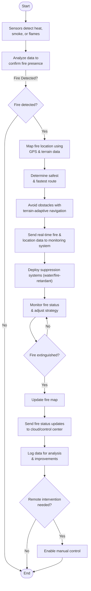

# FireFighter

## Fire Detection and Suppression Flowchart

```mermaid
flowchart TD
  %% Fire Detection Phase
  A1([Start]) --> A2["Sensors detect heat,
smoke, or flames"]
  A2 --> A3["Analyze data to
confirm fire presence"]
  A3 -->|Fire Detected?| A4{"Fire detected?"}
  A4 -- No --> A5([End])
  A4 -- Yes --> A6["Map fire location using
GPS & terrain data"]

  %% Navigation and Decision Phase
  A6 --> B1["Determine safest
 & fastest route"]
  B1 --> B2["Avoid obstacles with
terrain-adaptive navigation"]
  B2 --> B3["Send real-time fire &
location data to monitoring system"]

  %% Fire Suppression Phase
  B3 --> C1["Deploy suppression systems (water/fire-retardant)"]
  C1 --> C2["Monitor fire status
& adjust strategy"]
  C2 --> C3{"Fire extinguished?"}
  C3 -- No --> C2
  C3 -- Yes --> C4["Update fire map"]

  %% Communication & Data Integration Phase
  C4 --> D1["Send fire status updates
to cloud/control center"]
  D1 --> D2["Log data for analysis
 & improvements"]
  D2 --> D3{"Remote intervention
needed?"}
  D3 -- Yes --> D4["Enable manual control"]
  D3 -- No --> A5([End])
  D4 --> A5([End])
```
### Note: This can be updated anytime. 
